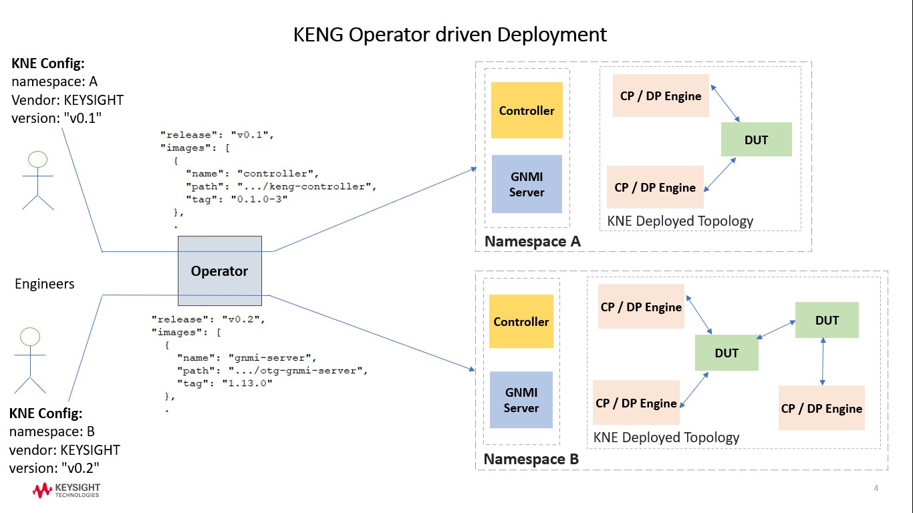

# KENG Operator

[](https://www.repostatus.org/#active)
[](https://opensource.org/licenses/Apache-2.0)
[](https://github.com/open-traffic-generator/keng-operator/releases/latest)
[](https://github.com/open-traffic-generator/keng-operator/actions)
[](https://lgtm.com/projects/g/open-traffic-generator/keng-operator/context:python)
[](https://lgtm.com/projects/g/open-traffic-generator/keng-operator/?mode=list)

Kubernetes Operator is built on the basic Kubernetes resources and controller concepts and includes application specific knowledge to automate common tasks like create, configure and manage instances on behalf of a Kubernetes user. It extends the functionality of the Kubernetes API and is used to package, deploy and manage Kubernetes application.<br/>
    
KENG Operator defines CRD for KENG specific network device ([IxiaTG](#ixiatg-crd)) and can be used to build up different network topologies with network devices from other vendors. Network interconnects between the topology nodes can be setup with various container network interface (CNI) plugins for Kubernetes for attaching multiple network interfaces to the nodes.<br/>

This process happens in two phases; in the first phase the operator identifies the network interconnects that needs to be setup externally. In the second phase, once the network interconnects are setup, the operator deploys the containers and services. This entire process has been much simplified with the use of [KNE](https://github.com/google/kne). It automates this process and enables us to setup network topologies in Kubernetes. KNE uses [Meshnet](https://github.com/networkop/meshnet-cni) CNI to setup the network interconnects. KENG Operator watches out for IxiaTG CRDs to be instantiated in Kubernetes environment and accordingly initiates Ixia specific resource management.<br/>
    
The various KENG component versions to be deployed is derived from the KENG release version as specified in the IxiaTG config. These component mappings are captured in ixiatg-configmap.yaml for each KENG release. The configmap, as shown in the snippet below, comprise of the KENG release version ("release"), and the list of qualified component versions, for that release. KENG Operator first tries to access these details from Keysight published releases; if unable to so, it tries to locate them in Kubernetes configmap. This allows users to have the operator load images from private repositories, by updating the configmap entries. Thus, for deployment with custom images, the user is expected to download release specific ixiatg-configmap.yaml from published [releases](https://github.com/open-traffic-generator/ixia-c/releases/). Then, in the configmap, update the specific container image "path" / "tag" fields and also update the "release" to some custom name. Start the operator first as specified in the deployment section below, before applying the configmap locally. After this the operator can be used to deploy the containers and services.<br/><br/>

```sh
  "release": "v0.1",
  "images": [
      {
          "name": "controller",
          "path": "ghcr.io/open-traffic-generator/keng-controller",
          "tag": "0.1.0-3"
      },
      {
          "name": "gnmi-server",
          "path": "ghcr.io/open-traffic-generator/otg-gnmi-server",
          "tag": "1.13.0"
      },
      {
          "name": "traffic-engine",
          "path": "ghcr.io/open-traffic-generator/ixia-c-traffic-engine",
          "tag": "1.6.0.85"
      },
      {
```

The operator deploys one single Controller pod with Ixia-c, gNMI and optionally license-server containers for user control, management and statistics reporting of KENG specific network devices. It also deploys KENG network device nodes for control and data plane. The deployed KENG resource release versions are anchored and dictated by the KENG release as defined in the KNE config file.

The KENG operator is available with three modes of licensing based deployment.
- Community: Default deployment with no licensing; functionality is restricted to a subset of features
- Seat: License enforcement based on number of concurrent test runs, uses a VM-based license server
- Site: License enforcement based on an enterprise agreement, uses a container-based license server 

<kbd>  </kbd><br/><br/>

## IxiaTG CRD

The IxiaTG CRD instance specifies the list of Ixia components to be deployed. These deployment details are captured in the CRD "spec" and comprise of the following fields.
- Release - KENG release specific components version to deploy
- Desired State - specify phase of deployment either INITIATED or DEPLOYED
- Api Endpoint Map - service end points for control and management of all KENG nodes in the topology
- Interfaces - the KENG list of interfaces and groups in the topology

In the first phase of deployment (desired state set to INITIATED), the operator determines the pod names and their interfaces that it will deploy in the second phase. It updates these details in the "status" component of the CRD instance, the "state" is also updated as specified in the "spec" desired state. The CRD instance "status" comprise of the following fields.
- State - status of the operation, either as specified in desired state or FAILED
- Reason - error message on failure
- Api Endpoint - generated service names for reference
- Interfaces - list of interface mappings with pod name and interface name

Based on these details, once the mesh of interconnects are setup, the IxiaTG CRD instance is updated with "spec" desired state set to DEPLOYED to trigger the pod and services deployment phase to start in the operator. On successful deployment the operator again updates the "status" state component to DEPLOYED. On failure state is set to FAILED and reason is updated with to error message. Below is an example of CRD instance.

```sh
spec:
  api_endpoint_map:
    gnmi:
      in: 50051
    http:
      in: 443
  desired_state: DEPLOYED
  interfaces:
  - name: eth1
  - group: lag
    name: eth2
  - group: lag
    name: eth3
  release: local-latest
status:
  api_endpoint:
    pod_name: otg-controller
    service_names:
    - service-gnmi-otg-controller
    - service-http-otg-controller
  interfaces:
  - interface: eth1
    name: eth1
    pod_name: otg-port-eth1
  - interface: eth2
    name: eth2
    pod_name: otg-port-group-lag
  - interface: eth3
    name: eth3
    pod_name: otg-port-group-lag
  state: DEPLOYED
```

Note: The operator sets the minimum cpu and memory requirement to the default value for each component, depending on the port configuration, based on the data captured [here](https://github.com/open-traffic-generator/ixia-c/blob/mkdocs/docs/reference_advanced_deployments.md).

## Deployment

### KENG Components

The following KENG release components are deployed by the operator.
- keng-controller
- otg-gnmi-server
- keng-license-server (optional)
- ixia-c-protocol-engine
- ixia-c-traffic-engine

### Deployment Steps

Please make sure that the setup meets [Deployment Prerequisites](#deployment-prerequisites).

- **Available Releases**
    https://github.com/open-traffic-generator/keng-operator/releases

- **Download Deployment yaml**

  ```sh
  curl -kLO "https://github.com/open-traffic-generator/keng-operator/releases/tag/v0.3.13/ixiatg-operator.yaml"
  ```

- **Load Image**

  ```sh
  docker pull ghcr.io/open-traffic-generator/keng-operator:0.3.13
  ```

- **Running as K8S Pod**

  ```sh
  kubectl apply -f ixiatg-operator.yaml
  ```

- **For apply seat based license (for NEMs)**
  
  ```sh
  kubectl create secret -n ixiatg-op-system generic license-server --from-literal=addresses="<space separated IP addresses>"
  ```

  Note for operator upgrades the previous secret, if any, is required to be deleted

  ```sh
  kubectl delete secret/license-server -n ixiatg-op-system
  ```

  The license can also be added by updating the ixiatg-configmap.yaml with a controller environment variable 'LICENSE_SERVERS' and applying the configmap.

  ```sh
     "release": "v0.1",
     "images": [
         {
             "name": "controller",
             "path": "ghcr.io/open-traffic-generator/keng-controller",
             "tag": "0.1.0-3",
             "env": {
                "LICENSE_SERVERS": "<space separated IP addresses>"
             }
         },
         {
  ```

  ```sh
  kubectl apply -f ixiatg-configmap.yaml
  ```

- **For apply site based license (for enterprise customers)**
  
  ```sh
  kubectl create secret -n ixiatg-op-system generic license-server --from-literal=image="<license container image>"
  ```

  Note for operator upgrades the previous secret, if any, is required to be deleted

  ```sh
  kubectl delete secret/license-server -n ixiatg-op-system
  ```

  The license can also be added by updating the ixiatg-configmap.yaml with an additional entry for license server container and applying the configmap.

  ```sh
     "release": "v0.1",
     "images": [
         {
             "name": "license-server",
             "path": "ghcr.io/open-traffic-generator/licensed/keng-license-server",
             "tag": "0.0.1-32"
         },
         {
  ```

  ```sh
  kubectl apply -f ixiatg-configmap.yaml
  ```

## Deployment Prerequisites

- Please make sure you have kubernetes cluster up in your setup.

## Build

- **Clone this project**

  ```sh
  git clone https://github.com/open-traffic-generator/keng-operator.git
  cd keng-operator/
  ```

- **For Production**

    ```sh
    export VERSION=latest
    export IMAGE_TAG_BASE=keng-operator

    # Generating keng-operator deployment yaml using Makefile
    make yaml
    # Generating docker build with name & tag (keng-operator:latest) using Makefile
    make docker-build
    ```

- **For Development**

    ```sh
    # after cloning the repo, some dependencies need to get installed for further development
    chmod u+x ./do.sh
    ./do.sh deps
    ```

## Quick Tour

**do.sh** covers most of what needs to be done manually. If you wish to extend it, just define a function (e.g. install_deps()) and call it like so: `./do.sh install_deps`.

```sh

# install dependencies
./do.sh deps
# build production docker image
./do.sh build
# generate production yaml for operator deployment
./do.sh yaml
```

## Test Changes

TBD


