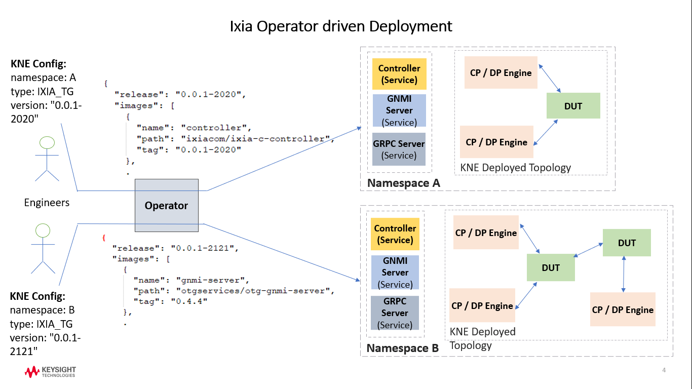

# Ixia-C Operator

[](https://www.repostatus.org/#active)
[](https://en.wikipedia.org/wiki/MIT_License)
[](https://github.com/open-traffic-generator/ixia-c-operator/releases/latest)
[](https://github.com/open-traffic-generator/ixia-c-operator/actions)
[](https://lgtm.com/projects/g/open-traffic-generator/ixia-c-operator/context:python)
[](https://lgtm.com/projects/g/open-traffic-generator/ixia-c-operator/?mode=list)

Kubernetes Operator is built on the basic Kubernetes resources and controller concepts and includes application specific knowledge to automate common tasks like create, configure and manage instances on behalf of a Kubernetes user. It extends the functionality of the Kubernetes API and is used to package, deploy and manage Kubernetes application.<br/>
    
Ixia Operator defines CRD for Ixia network device ([IxiaTG](#ixiatg-crd)) and can be used to build up different network topologies with network devices from other vendors. Network interconnects between the topology nodes can be setup with various container network interface (CNI) plugins for Kubernetes for attaching multiple network interfaces to the nodes.<br/>
    
[KNE](https://github.com/google/kne) automates this process and enables us to setup network topologies in Kubernetes. It uses [Meshnet](https://github.com/networkop/meshnet-cni) CNI to setup the network interconnects. Ixia Operator watches out for IxiaTG CRDs to be instantiated in Kubernetes environment and accordingly initiates Ixia specific resource management.<br/>
    
The various Ixia component versions to be deployed is derived from the Ixia release version as specified in the IxiaTG config. These component mappings are captured in ixia-configmap.yaml for each Ixia release. Ixia Operator first tries to access these details from Keysight published releases; in case of failure or in absence of internet connectivity, it tries to locate them in Kubernetes configmap. Thus, for the second scenario, the user is expected to separately download release specific ixia-configmap.yaml from published [releases](https://github.com/open-traffic-generator/ixia-c/releases/), and apply it locally; after the operator is started.<br/>

Below is a snippet of a ixia-configmap.yaml. Users can deploy custom versions by applying a configmap with custom updates and then specifying that custom version in KNE config file.<br/><br/>

```sh
  "release": "local-latest",
  "images": [
      {
          "name": "controller",
          "path": "ixiacom/ixia-c-controller",
          "tag": "0.0.1-2994",
          "args": ["--accept-eula"]
      },
      {
          "name": "gnmi-server",
          "path": "ixiacom/ixia-c-gnmi-server",
          "tag": "1.8.3",
          "command": ["python3", "-m", "otg_gnmi"]
      },
      {
          "name": "traffic-engine",
          "path": "docker-local-ixvm-lbj.artifactorylbj.it.keysight.com/athena-traffic-engine",
          "tag": "1.4.1.29",
          "env": {
              "OPT_LISTEN_PORT": "5556"
          }
      },
      {
```

Following customizations are supported for the image components; as shown in the sample configmap above:
1. Specify a custom location ("path").
2. Specify a custom version ("tag").
3. Specify custom "command", "args" or "env" to override standard built-in ones.

If some of the required images are not publicly available and distributed under license, user would be required to create a secret with docker authorization details as supplied by Keysight. The operator would refer to this secret for deploying from private repository.<br/><br/>

<kbd>  </kbd><br/><br/>

The operator deploys one single Controller pod with Ixia-c, gNMI and gRPC containers for user control, management and statistics reporting of Ixia network devices; and Ixia network devices for control and data plane. The deployed Ixia resource release versions are anchored and dictated by the Ixia-c release as defined in the KNE config file.

## IxiaTG CRD

## Deployment

Please make sure that the setup meets [Deployment Prerequisites](#deployment-prerequisites).

- **Available Releases**
    https://github.com/open-traffic-generator/ixia-c-operator/releases

- **Download Deployment yaml**

  ```sh
  curl -kLO "https://github.com/open-traffic-generator/ixia-c-operator/releases/tag/v0.0.65/ixiatg-operator.yaml"
  ```

- **Load Image**

  ```sh
  docker pull ixiacom/ixia-c-operator:0.0.65
  ```

- **Running as K8S Pod**

  ```sh
  kubectl apply -f ixiatg-operator.yaml
  ```

## Deployment Prerequisites

- Please make sure you have kubernetes cluster up in your setup.

## Build

- **Clone this project**

  ```sh
  git clone https://github.com/open-traffic-generator/ixia-c-operator.git
  cd ixia-c-operator/
  ```

- **For Production**

    ```sh
    export VERSION=latest
    export IMAGE_TAG_BASE=ixia-c-operator

    # Generating ixia-c-operator deployment yaml using Makefile
    make yaml
    # Generating docker build with name & tag (ixia-c-operator:latest) using Makefile
    make docker-build
    ```

- **For Development**

    ```sh
    # after cloning the repo, some dependencies need to get installed for further development
    chmod u+x ./do.sh
    ./do.sh deps
    ```

## Quick Tour

**do.sh** covers most of what needs to be done manually. If you wish to extend it, just define a function (e.g. install_deps()) and call it like so: `./do.sh install_deps`.

```sh

# install dependencies
./do.sh deps
# build production docker image
./do.sh build
# generate production yaml for operator deployment
./do.sh yaml
```

## Test Changes

TBD


